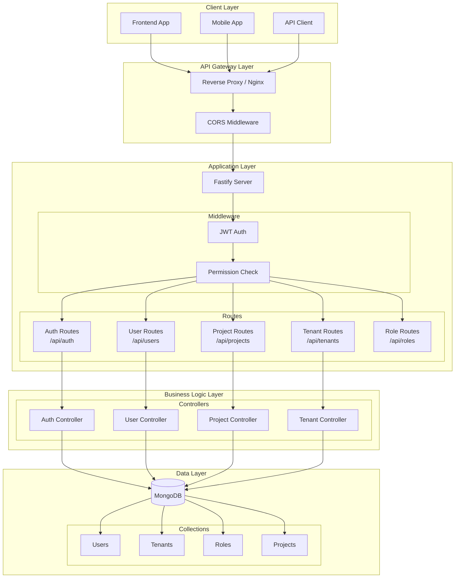
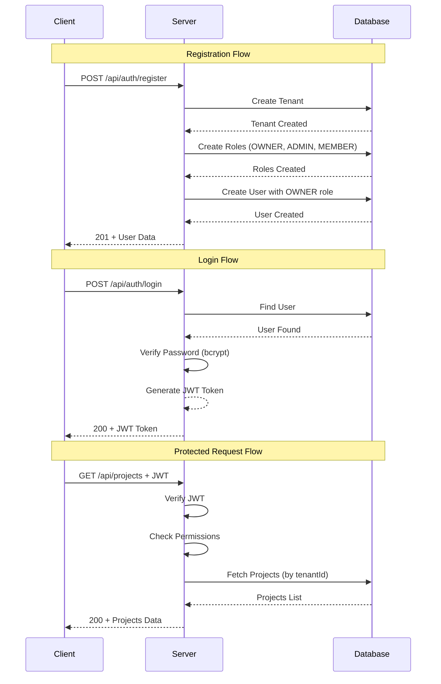
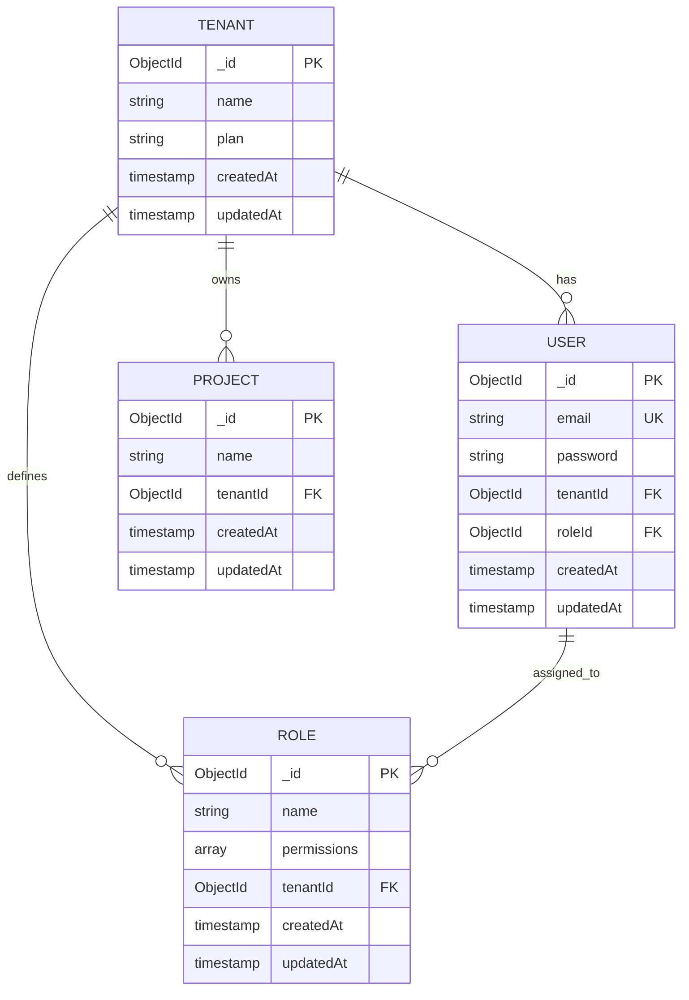

# RBAC Backend API

<div align="center">

<!-- Badges -->


<!-- Project Banner -->
<p align="center">
  
</p>

<!-- Build Status -->

[](https://github.com/Dhairya0707/rbac-multi-tenant-api/actions)
[]()
[]()

<!-- GitHub Repository -->
<p align="center">
  <a href="https://github.com/Dhairya0707/rbac-multi-tenant-api">
    
  </a>
</p>

</div>

---

A production-ready Role-Based Access Control (RBAC) system built with Fastify, providing multi-tenant architecture with granular permission management.

---

## Table of Contents

- [Overview](#overview)
- [Architecture](#architecture)
- [Tech Stack](#tech-stack)
- [Project Structure](#project-structure)
- [Features](#features)
- [Getting Started](#getting-started)
- [Environment Variables](#environment-variables)
- [API Documentation](#api-documentation)
- [Authentication & Authorization](#authentication--authorization)
- [Database Schema](#database-schema)
- [Error Handling](#error-handling)
- [Development Guidelines](#development-guidelines)
- [Deployment](#deployment)
- [License](#license)

---

## Overview

This is a robust RBAC backend system designed for SaaS applications requiring multi-tenant support. Each tenant (organization) gets isolated data with customizable roles and permissions.

### Key Capabilities

- **Multi-Tenancy**: Complete data isolation between organizations
- **Role-Based Access Control**: Flexible permission system with role hierarchy
- **JWT Authentication**: Secure token-based authentication with expiration
- **RESTful API**: Clean, consistent API design following best practices
- **Static File Serving**: Built-in support for serving frontend assets
- **Built-in UI for Testing**: Interactive API testing interface included

---

## Quick Start with UI

### Testing the API

This project includes a built-in HTML UI for testing all API endpoints. Once the server is running:

1. **Start the server:**

   ```bash
   pnpm dev
   ```

2. **Open the UI in your browser:**
   ```
   http://localhost:3000
   ```

The UI provides:

- Interactive forms for all API endpoints
- JWT token management (auto-save to localStorage)
- One-click authentication testing
- Visual response display

---

## Architecture

### System Architecture Diagram



### Authentication Flow



### Data Model Relationships



---

## Tech Stack

| Category         | Technology         | Logo                                                                                            |
| ---------------- | ------------------ | ----------------------------------------------------------------------------------------------- |
| Framework        | Fastify v5         |  |
| Database         | MongoDB + Mongoose |                    |
| Authentication   | @fastify/jwt       | 🔐                                                                                              |
| CORS             | @fastify/cors      | 🌐                                                                                              |
| Static Files     | @fastify/static    | 📁                                                                                              |
| Password Hashing | bcrypt             | 🔒                                                                                              |
| Environment      | dotenv             | ⚙️                                                                                              |
| Development      | nodemon            | 🔄                                                                                              |

---

## Project Structure

```
rbac/
├── .env                          # Environment variables (not committed)
├── server.js                     # Application entry point
├── package.json                  # Dependencies and scripts
├── public/                       # Static assets (frontend UI for testing)
│   └── index.html                # Interactive API testing UI
│
└── src/
    ├── app.js                    # Fastify app configuration
    │
    ├── config/
    │   └── db.js                 # MongoDB connection manager
    │
    ├── middleware/
    │   └── permission.middleware.js  # Role-based permission validation
    │
    ├── model/                    # Mongoose schemas
    │   ├── user.model.js         # User schema
    │   ├── tenant.model.js      # Tenant/Organization schema
    │   ├── role.model.js        # Role schema with permissions
    │   └── project.model.js     # Project schema
    │
    ├── module/                   # Business logic controllers
    │   ├── auth/
    │   │   ├── login.controller.js
    │   │   └── register.controller.js
    │   ├── user/
    │   │   └── me.controller.js
    │   ├── project/
    │   │   ├── create.controller.js
    │   │   ├── fetch.controller.js
    │   │   └── delete.controller.js
    │   └── tenant/
    │       ├── member.invite.controller.js
    │       ├── member.view.controller.js
    │       ├── delete.user.controller.js
    │       └── change.role.controller.js
    │
    ├── router/                   # Route definitions
    │   ├── auth.route.js         # /api/auth
    │   ├── user.route.js         # /api/users
    │   ├── project.route.js     # /api/projects
    │   ├── tenant.route.js      # /api/tenants
    │   └── role.route.js        # /api/roles
    │
    └── utils/
        └── token.js             # JWT token generation utility
```

---

## Features

### Core Features

1. **User Authentication**
   - Registration with automatic tenant and role creation
   - Login with JWT token generation
   - Token expiration: 24 hours

2. **Multi-Tenant Architecture**
   - Each registered company gets isolated tenant
   - All data queries filtered by tenantId
   - Automatic OWNER, ADMIN, MEMBER role creation

3. **Role & Permission Management**
   - Pre-defined roles: OWNER, ADMIN, MEMBER
   - Granular permission system
   - Role assignment during user invitation

4. **Project Management**
   - Create, read, delete projects
   - Tenant-scoped project isolation

5. **Team Management**
   - Invite new members with specific roles
   - View all organization members
   - Update user roles
   - Remove users from organization

6. **Health Monitoring**
   - Built-in health check endpoint
   - Server uptime tracking

7. **Interactive Testing UI**
   - Built-in HTML interface for API testing
   - JWT token management
   - Visual request/response display

---

## Getting Started

### Prerequisites

- Node.js (v18+)
- MongoDB (local or Atlas)
- pnpm (recommended) or npm

### Installation

```bash
# Clone the repository
cd rbac

# Install dependencies
pnpm install
# or
npm install
```

### Configuration

Create a `.env` file in the root directory:

```env
# Required
MONGO_URL=mongodb+srv://<username>:<password>@<cluster>.mongodb.net/
JWT_SECRET=your-super-secret-jwt-key-min-32-chars

# Optional
PORT=3000
DEFAULT_INVITE_PASSWORD=123456
```

### Running the Application

```bash
# Development mode (with auto-reload)
pnpm dev

# Production mode
node server.js
```

The server will start on `http://localhost:3000`

### Access the Testing UI

Once the server is running, open your browser and navigate to:

```
http://localhost:3000
```

This will load the interactive API testing UI where you can:

- Register a new tenant/company
- Login and get JWT token
- Test all protected endpoints
- View and manage projects
- Invite and manage team members

---

## Environment Variables

| Variable                  | Required | Description                | Default  |
| ------------------------- | -------- | -------------------------- | -------- |
| `MONGO_URL`               | Yes      | MongoDB connection string  | -        |
| `JWT_SECRET`              | Yes      | Secret key for JWT signing | -        |
| `PORT`                    | No       | Server port number         | `3000`   |
| `DEFAULT_INVITE_PASSWORD` | No       | Password for invited users | `123456` |

---

## API Documentation

### Base URL

```
http://localhost:3000
```

All protected endpoints require:

```
Authorization: Bearer <jwt_token>
```

### Endpoints Summary

| Method | Endpoint              | Auth | Permission       | Description              |
| ------ | --------------------- | ---- | ---------------- | ------------------------ |
| GET    | `/api/health`         | ❌   | -                | Health check             |
| POST   | `/api/auth/register`  | ❌   | -                | Register new tenant      |
| POST   | `/api/auth/login`     | ❌   | -                | User login               |
| GET    | `/api/users/me`       | ✅   | -                | Get current user profile |
| PATCH  | `/api/users/:id/role` | ✅   | `user:update`    | Update user role         |
| DELETE | `/api/users/:id`      | ✅   | `user:delete`    | Delete user              |
| POST   | `/api/projects/`      | ✅   | `project:create` | Create project           |
| GET    | `/api/projects/`      | ✅   | -                | List all projects        |
| DELETE | `/api/projects/:id`   | ✅   | `project:delete` | Delete project           |
| POST   | `/api/tenants/member` | ✅   | `user:invite`    | Invite new member        |
| GET    | `/api/tenants/member` | ✅   | `user:view`      | List all members         |
| GET    | `/api/roles/`         | ✅   | `roles:view`     | List all roles           |

### Detailed API Docs

For complete API documentation including request/response formats, see [project_endpoint.md](project_endpoint.md).

---

## Authentication & Authorization

### Authentication Flow

```
1. User registers → Tenant + Roles + User created
2. User logs in → JWT token returned
3. User makes request → Token validated
4. Request processed → Data returned
```

### JWT Token Structure

```json
{
  "userId": "ObjectId",
  "tenantId": "ObjectId",
  "roleId": "ObjectId"
}
```

### Permission Middleware

The `permission.middleware.js` validates whether the authenticated user's role includes the required permission.

**Default Roles & Permissions:**

| Role   | Permissions                                         |
| ------ | --------------------------------------------------- |
| OWNER  | `["*"]` (all permissions)                           |
| ADMIN  | `["project:create", "project:view", "user:invite"]` |
| MEMBER | `["project:view"]`                                  |

---

## Database Schema

### User

```javascript
{
  email: String,        // Unique, required
  password: String,     // Hashed, required
  tenantId: ObjectId,   // Reference to Tenant
  roleId: ObjectId      // Reference to Role
}
```

### Tenant

```javascript
{
  name: String,         // Company name, required
  plan: String          // "Free" or "Pro"
}
```

### Role

```javascript
{
  name: String,         // Role name (OWNER, ADMIN, MEMBER)
  permissions: [String], // Array of permission strings
  tenantId: ObjectId    // Reference to Tenant
}
```

### Project

```javascript
{
  name: String,         // Project name, required
  tenantId: ObjectId   // Reference to Tenant
}
```

---

## Error Handling

All API errors follow a consistent format:

```json
{
  "statusCode": 400,
  "error": "Bad Request",
  "message": "Descriptive error message"
}
```

### HTTP Status Codes

| Code | Meaning               |
| ---- | --------------------- |
| 200  | Success               |
| 201  | Created               |
| 400  | Bad Request           |
| 401  | Unauthorized          |
| 403  | Forbidden             |
| 404  | Not Found             |
| 409  | Conflict              |
| 500  | Internal Server Error |

---

## Development Guidelines

### Code Organization

- **Routes**: Define endpoints and attach middleware
- **Controllers**: Handle business logic and responses
- **Models**: Define database schemas
- **Middleware**: Cross-cutting concerns (auth, permissions)

### Best Practices

1. **Always validate input** using Fastify schemas
2. **Use async/await** for all database operations
3. **Log errors** using `req.log.error()`
4. **Return consistent response** format across all endpoints
5. **Filter queries** by tenantId for data isolation

### Adding New Endpoints

```javascript
// 1. Create controller in src/module/<feature>/
async function myController(req, res) {
  try {
    // Business logic here
    return res.status(200).send({ data: result });
  } catch (error) {
    req.log.error(error);
    return res.status(500).send({ error: "Internal Server Error" });
  }
}

// 2. Define route in src/router/<feature>.route.js
fastify.get("/", { onRequest: [fastify.authenticate] }, myController);

// 3. Register route in server.js
app.register(myRoute, { prefix: "/api/myfeature" });
```

---

## Deployment

### Production Checklist

- [ ] Set production MongoDB connection
- [ ] Use strong JWT_SECRET
- [ ] Enable proper CORS settings
- [ ] Set up logging/monitoring
- [ ] Configure environment variables
- [ ] Use PM2 or similar for process management

### Docker (Optional)

```dockerfile
FROM node:18-alpine
WORKDIR /app
COPY package.json pnpm-lock.yaml ./
RUN npm install -g pnpm && pnpm install
COPY . .
EXPOSE 3000
CMD ["node", "server.js"]
```

### PM2 Production Run

```bash
pm2 start server.js --name rbac-api
pm2 save
pm2 startup
```

---

## License

ISC License - See LICENSE file for details

---

## Support

For issues and feature requests, please open an issue on the project repository.
{
"statusCode": 401,
"error": "Unauthorized",
"message": "Tenant information missing from token."
}

````

- **Response (Error - 403)**:

```json
{
  "statusCode": 403,
  "error": "Forbidden",
  "message": "You do not have permission to create projects"
}
````

- **Response (Error - 500)**:

```json
{
  "statusCode": 500,
  "error": "Internal Server Error",
  "message": "An unexpected error occurred while creating the project."
}
```

---

#### GET `/api/project/`

- **Description**: Fetches all projects belonging to the authenticated user's tenant.
- **Authentication**: Required (JWT Bearer token)
- **Request Headers**:

```
Authorization: Bearer <jwt_token>
```

- **Response (Success - 200)**:

```json
{
  "data": [
    {
      "name": "Project 1"
    },
    {
      "name": "Project 2"
    }
  ]
}
```

- **Response (Error - 401)**:

```json
{
  "statusCode": 401,
  "error": "Unauthorized",
  "message": "Invalid or expired token"
}
```

---

## Authentication & Authorization

### Authentication Flow

1. User registers via `/api/auth/register` → Tenant, Roles, and User are created
2. User logs in via `/api/auth/login` → JWT token is returned
3. User includes JWT token in `Authorization` header for protected endpoints

### JWT Token Structure

The token contains:

- `userId`: The user's unique identifier
- `tenantId`: The tenant/company the user belongs to
- `roleId`: The user's role within the tenant

### Permission Middleware

The `permssionValidation` middleware (note the typo) checks if the authenticated user's role has the required permission. Permissions are stored in the Role model as an array of strings.

**Default Roles & Permissions:**

| Role   | Permissions                                         |
| ------ | --------------------------------------------------- |
| OWNER  | `["*"]` (all permissions)                           |
| ADMIN  | `["project:create", "project:view", "user:invite"]` |
| MEMBER | `["project:view"]`                                  |

---

## Error Handling

All error responses follow a consistent format:

```json
{
  "statusCode": 400,
  "error": "Bad Request",
  "message": "Descriptive error message"
}
```

### Common HTTP Status Codes

| Code | Meaning               |
| ---- | --------------------- |
| 200  | Success               |
| 201  | Created               |
| 400  | Bad Request           |
| 401  | Unauthorized          |
| 403  | Forbidden             |
| 404  | Not Found             |
| 409  | Conflict              |
| 500  | Internal Server Error |

---

## Project Structure

```
rbac/
├── server.js                 # Entry point
├── src/
│   ├── app.js               # Fastify app configuration
│   ├── config/
│   │   └── db.js            # Database connection
│   ├── middleware/
│   │   └── permission.middleware.js  # Permission validation
│   ├── model/
│   │   ├── user.model.js   # User schema
│   │   ├── tenant.model.js # Tenant schema
│   │   ├── role.model.js   # Role schema
│   │   └── project.model.js # Project schema
│   ├── module/
│   │   ├── auth/
│   │   │   ├── login.controller.js
│   │   │   └── register.controller.js
│   │   └── project/
│   │       ├── create.controller.js
│   │       └── fetch.controller.js
│   ├── router/
│   │   ├── auth.route.js
│   │   ├── user.route.js
│   │   └── project.route.js
│   └── utils/
│       └── token.js        # JWT token generation
├── package.json
└── pnpm-lock.yaml
```

---

## Getting Started

### Prerequisites

- Node.js
- MongoDB
- pnpm (or npm/yarn)

### Installation

```bash
pnpm install
```

### Environment Variables

Create a `.env` file with:

```
JWT_SECRET=your_secret_key
```

### Running the Server

```bash
node server.js
# or
pnpm start
```

The server will run on `http://localhost:3000`
